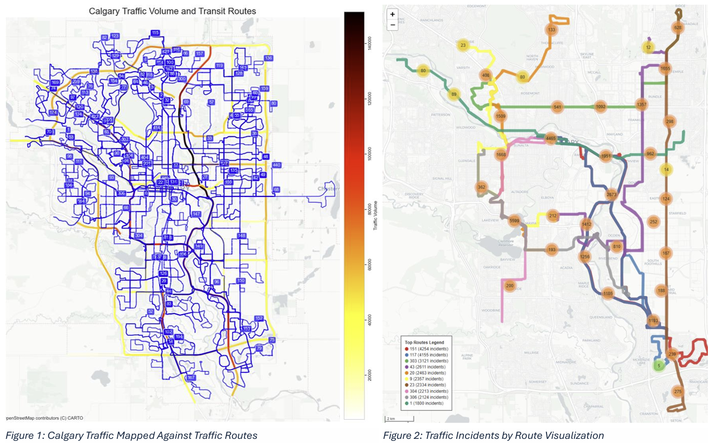
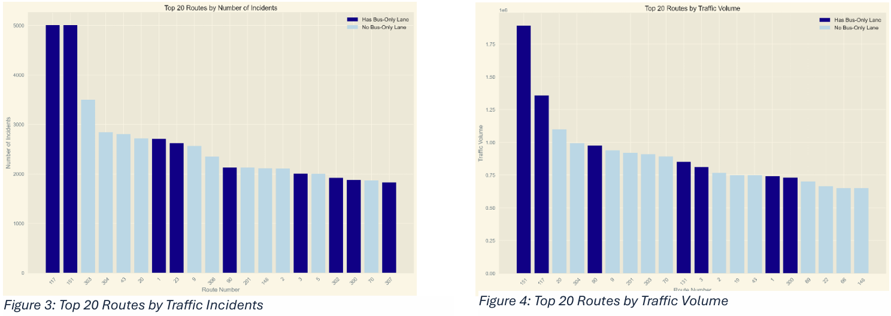
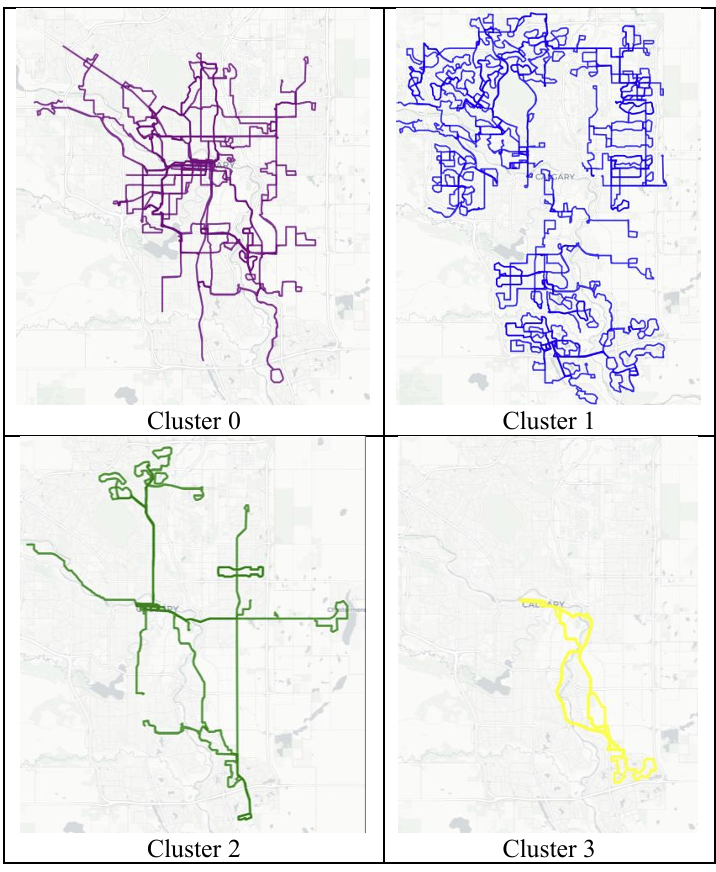

# Using Data Mining Techniques to Analyze Traffic Incidents and Volume Around Bus-Only Lanes in Calgary

A data-driven analysis using K-means clustering to optimize bus lane implementation and enforcement strategies in Calgary's transit network.

## Project Overview

This project employs data mining techniques to analyze traffic incidents and volumes around bus-only lanes in Calgary, providing evidence-based recommendations for transit priority infrastructure. By integrating multiple datasets and applying unsupervised learning, the research identifies distinct patterns in Calgary's transit network that can inform both implementation and enforcement decisions.

## Key Findings

The analysis identified **four distinct clusters** of transit routes, each with different characteristics and needs:

- **Cluster 0** (Medium-High Priority): 30 routes with high ridership but only 6.7% bus lane coverage - prime candidates for expansion
- **Cluster 1** (Low Priority): 102 routes with smooth operations and minimal need for bus lanes (3.9% coverage)  
- **Cluster 2** (High Priority): 16 routes with 100% bus lane coverage, confirming effective placement on high-ridership corridors
- **Cluster 3** (Critical Routes): 2 routes with extreme conditions, both with existing bus lanes requiring intensive enforcement

As shown in **Figure 6** (Clustering Result Plot), these clusters occupy distinct regions in the priority-flow impedance space, validating the analytical framework.

## Methodology

### Data Integration
The project combines five datasets from Calgary Open Data and Calgary Transit:
- Calgary Transit Routes (geometric route information)
- Calgary Transit GTFS Data (schedule and service information)
- Calgary Traffic Incidents (real-time incident archive)
- 2023 Traffic Volume Data (seasonal-adjusted traffic counts)
- Bus Reserved Lanes (infrastructure locations and specifications)

### Feature Engineering
Two key metrics were developed:

**Priority Metric** (quantifies bus lane implementation need):
- Transit demand component (40%): ridership estimates and peak hour trips
- Traffic impedance component (40%): traffic volume and incident counts
- Existing infrastructure penalty (20%): reduces priority for routes with existing bus lanes

**Flow Impedance Metric** (measures traffic disruption):
- Traffic volume component (40%)
- Traffic incident component (30%)  
- Incident-to-volume ratio (30%): captures areas with unusually high incident rates

### Analysis Pipeline
1. **Data Preprocessing**: Cleaning, filtering, and spatial integration
2. **Exploratory Data Analysis**: Initial pattern identification (**Figures 1-5**)
3. **Feature Engineering**: Metric development and normalization
4. **K-means Clustering**: Unsupervised pattern discovery (k=4)
5. **Geographic Visualization**: Spatial pattern analysis (**Figure 7**)
6. **Recommendation Development**: Cluster-specific strategies

## Key Visualizations

- **Figures 1-2**: Show traffic density and incident patterns across Calgary's transit network
<p align="center">
  
</p>
<p align="center"><em>Figures 1 & 2: Traffic volume mapping and incident distribution across Calgary's transit network</em></p>

- **Figures 3-4**: Demonstrate that routes with bus lanes consistently rank in top 20 for both traffic incidents and volume
<p align="center">
  
</p>
<p align="center"><em>Figures 3 & 4: Top 20 routes by traffic incidents and volume - routes with bus lanes consistently rank highest, validating strategic placement</em></p>

- **Figure 6**: Illustrates all clusters visualized on the map of Calgary
<p align="center">
  
</p>
<p align="center"><em>Figure 7: Geographic distribution of route clusters across Calgary, showing spatial patterns in transit infrastructure needs</em></p>

- **Figure 7**: Maps spatial distribution of clusters across Calgary's geography (seperated)
<p align="center">
  
</p>
<p align="center"><em>Cluster Analysis: Four distinct route categories identified through K-means clustering</em></p>
## Data Sources

All datasets sourced from:
- [City of Calgary Open Data Portal](https://data.calgary.ca/)
- Calgary Transit GTFS feeds
- Advanced Traveler Information System (ATIS)

## Technical Requirements

```python
# Core libraries
pandas>=1.3.0
numpy>=1.21.0
geopandas>=0.10.0
scikit-learn>=1.0.0
folium>=0.12.0
matplotlib>=3.5.0
seaborn>=0.11.0

# Geospatial processing
shapely>=1.8.0
pyproj>=3.2.0
```

## Repository Structure

```
├── data/                          # Raw and processed datasets
│   ├── Calgary_Transit_Routes/
│   ├── CT_GTFS/
│   ├── Traffic_Incidents/
│   └── processed/
├── notebooks/                     # Jupyter analysis notebooks
│   ├── 01_data_preprocessing.ipynb
│   ├── 02_exploratory_analysis.ipynb
│   ├── 03_feature_engineering.ipynb
│   ├── 04_clustering_analysis.ipynb
│   └── 05_visualization.ipynb
├── src/                          # Python source code
│   ├── data_preprocessing.py
│   ├── feature_engineering.py
│   ├── clustering_analysis.py
│   └── visualization.py
├── results/                      # Analysis outputs
│   ├── figures/
│   ├── cluster_results.csv
│   └── recommendations.csv
└── README.md
```

## Usage

1. **Data Preprocessing**:
   ```bash
   python src/data_preprocessing.py
   ```

2. **Feature Engineering**:
   ```bash
   python src/feature_engineering.py
   ```

3. **Clustering Analysis**:
   ```bash
   python src/clustering_analysis.py
   ```

4. **Generate Visualizations**:
   ```bash
   python src/visualization.py
   ```

## Recommendations by Cluster

### Cluster 0 - Implementation Priority
- **Routes**: 30 high-ridership routes with minimal bus lane coverage
- **Action**: Priority candidates for new bus lane implementation
- **Enforcement**: Target peak hours at key congestion points

### Cluster 1 - Maintenance Focus  
- **Routes**: 102 routes with smooth operations
- **Action**: Maintain current service levels
- **Enforcement**: Light, intermittent enforcement with educational campaigns

### Cluster 2 - Enhancement Focus
- **Routes**: 16 high-ridership corridors with existing bus lanes
- **Action**: Optimize existing infrastructure performance
- **Enforcement**: Consistent enforcement to protect high-ridership corridors

### Cluster 3 - Critical Infrastructure
- **Routes**: 2 routes with extreme conditions
- **Action**: Consider additional bus lanes or physical separation
- **Enforcement**: Intensive enforcement with cameras and physical barriers

## Academic Context

This project was completed as part of ENCI 619.4 - Data Mining for Urban Infrastructure Applications at the University of Calgary, Winter 2025. The methodology demonstrates practical application of unsupervised learning techniques to real-world transportation planning challenges.

## Citation

```
Dawood, B. (2025). Analyzing Traffic Incidents and Volume Around Bus-Only 
Lanes in Calgary Using Data Mining Techniques. ENCI 619.4 Final Project, 
University of Calgary.
```

## Future Work

- Integration of real-time bus GPS data for performance validation
- Temporal analysis matching incident timing with bus operations  
- Automated Passenger Counter (APC) data integration for precise ridership figures
- Cost-benefit analysis of recommended implementations

## Contact

For questions about this research or access to datasets, please refer to the City of Calgary Open Data Portal or contact the University of Calgary Department of Civil Engineering.
